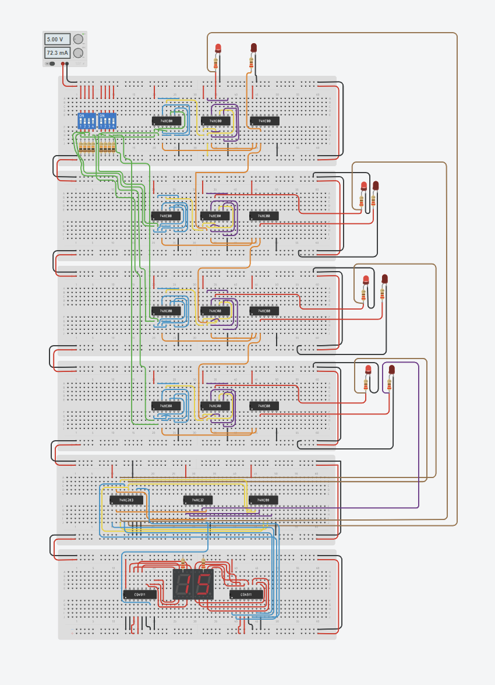

# 4-Bit Arithmetic Logic Unit (ALU) - Pure Hardware Implementation

This project is a fully functional 4-bit hardware processor designed and simulated in Tinkercad. It performs binary addition using discrete logic gates rather than a pre-programmed microcontroller, demonstrating a deep understanding of computer architecture and digital logic.

## 🚀 Live Simulation
[👉 Click here to view and test the circuit on Tinkercad](PASTE_YOUR_TINKERCAD_LINK_HERE)

## 🛠️ Hardware Specifications
- **Logic Gates:** 74HC00 (NAND), 74HC08 (AND), 74HC32 (OR).
- **Arithmetic Core:** 74HC283 4-Bit Binary Full Adder.
- **Display Driver:** Dual CD4511 BCD-to-7-Segment Decoders.
- **Key Logic:** Custom hardware "Add-6" BCD translation circuit to accurately display decimal values (0-19) across two digits.

## 🧩 Modular System Architecture

To ensure high reliability and organized signal flow, the processor is divided into 6 distinct hardware modules:

1. **Input Control Module:** Manages the 4-bit binary inputs using DIP switches and pull-down resistors for stable logic levels.
2. **Arithmetic Processing Core:** The heart of the system, utilizing the 74HC283 4-Bit Binary Full Adder for real-time calculations.
3. **BCD Translation Logic (Add-6):** A custom-designed hardware circuit that detects values greater than 9 and adds a binary 6 to correctly translate binary to BCD.
4. **Display Driver Stage:** Dual CD4511 ICs that decode the BCD signals into 7-segment patterns.
5. **Output Display (Units):** Dedicated 7-segment display for the unit's place (0-9).
6. **Output Display (Tens):** Dedicated 7-segment display for the ten's place (0-1).

---
## 📸 Project Preview

## 🧠 Engineering Highlights
- Designed a ripple-carry adder architecture from discrete logic gate levels.
- Successfully implemented hardware-level binary-to-decimal (BCD) translation for dual-display output.
- Optimized complex multi-breadboard wiring for high readability and circuit integrity.

---
**Developed and Built by Mushfique Bin Shafique**
